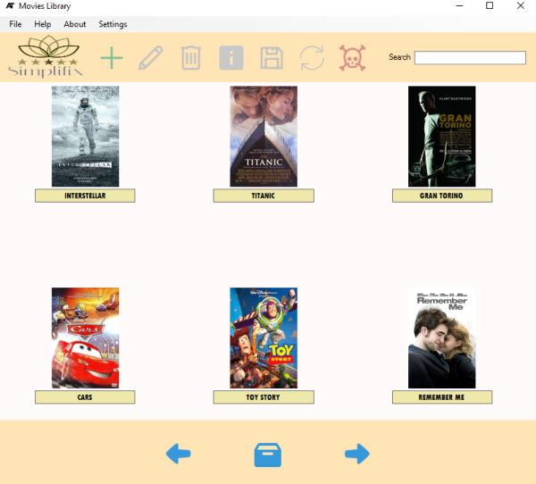

Movies Library
===============================

During the programming project of Haute École en Hainaut, I needed to develop a
library movies disregarding all technologies and frameworks, as well as database
to focus on the basics technologies of the language by taking care of the
program's complexity and the GUI (Graphical User Interface) for the user.

This project was made using WinForm according to the requirements imposed during
the design of this project.

It would be preferable to rewrite this project using the WPF.

--------------------

### Usage ###

Import the project from Visual Studio or as you usually do for the C# projects.

--------------------

### Contributions ###

Various functions may be optimized or spelling errors may occur. If you want to
make your own correction on these files, you are free to do so.

--------------------

### License ###

Code is under the [Apache Licence v2](https://www.apache.org/licenses/LICENSE-2.0.txt).
